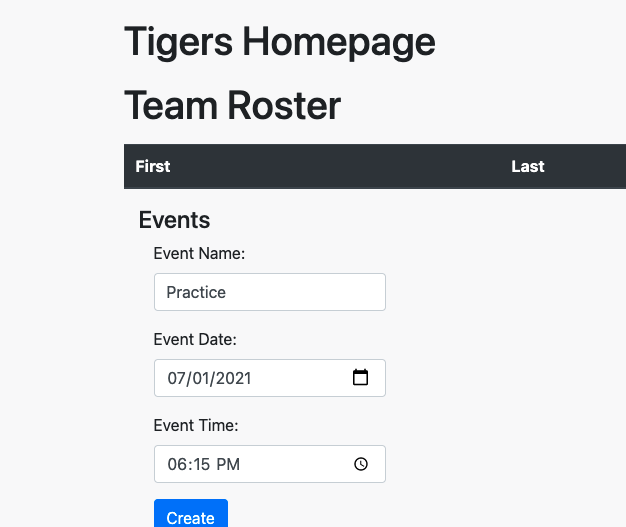
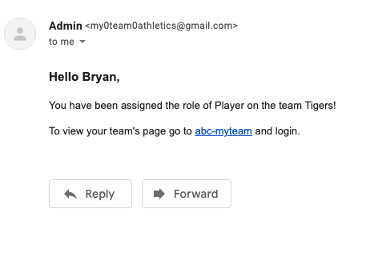
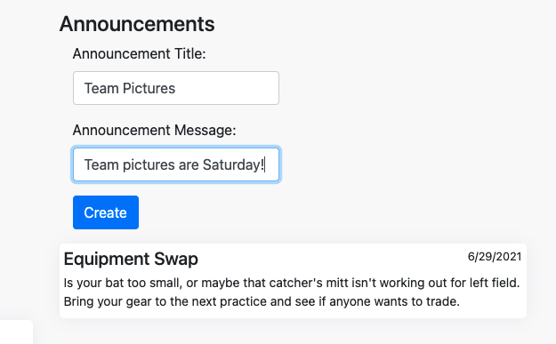

# myTeam


## Description

myTeam is an athletics program management system that allows players, coaches, and admins to focus on the game, rather than team administration. Player and team management modules allow admistrators to roster players and assign coaches, and the scheduling and announcement modules make organizing a breeze. No more group texts or shared calenders - everything you need is right here.

# USER STORY
```AS an ADMINISTRATOR, I want to be able to host my team/league on a website, post scores, stats, and , and keep up with my athletes' statistics and attendance as they go through a season. AS an ATHLETE, I want to be able to keep up real time access to my statistics, team schedule, practice schedule and record.```

## Table of Contents

- [Installation](#installation)
- [Usage](#usage)
- [Contributions](#contributions)
- [Testing Information](#testing)
- [License](#license)
- [Questions](#questions)

## Installation

Install dependencies using

```
npm install
```

## Usage
A live version of the application can be found on the web [on heroku](https://abc-myteam.herokuapp.com/login).

If running the application locally use

```
npm run start
```






## Contributions

[](code_of_conduct.md)

## Testing

No testing available.

## License

This project is covered under a/an MIT license. For more information see GitHub documentation on licensing a project [here](https://docs.github.com/en/communities/setting-up-your-project-for-healthy-contributions/adding-a-license-to-a-repository).

## Questions

​For questions, get in touch on [GitHub](https://github.com/btdubbzzz/) or email me at [a@b.c](mailto:a@b.c).
